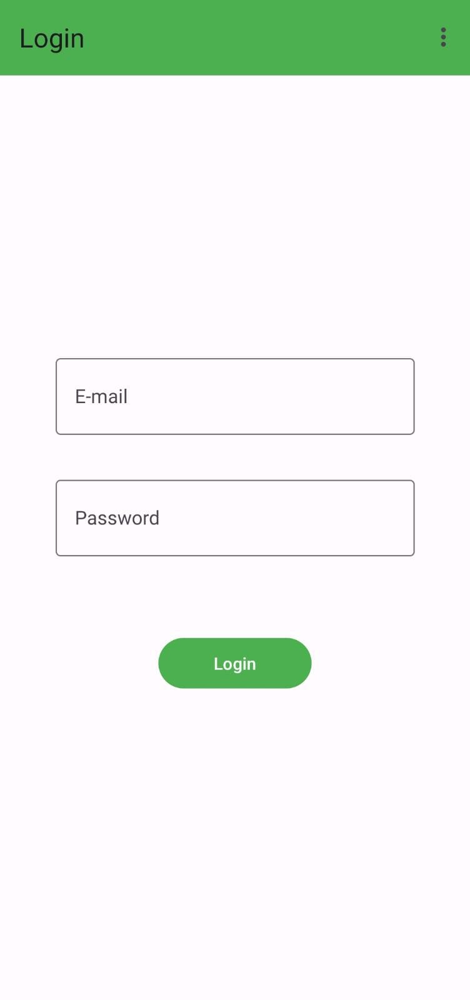
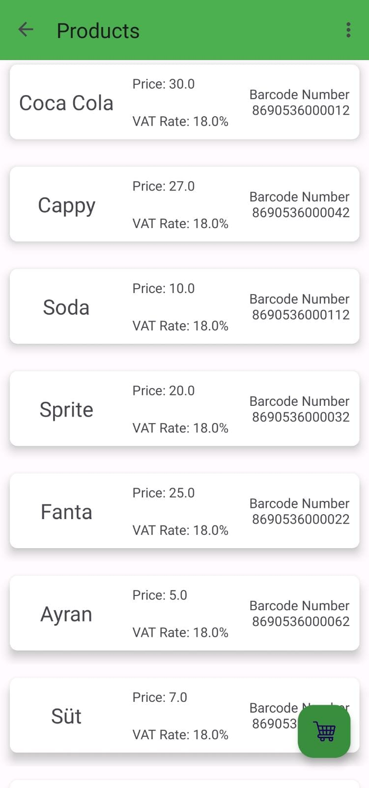
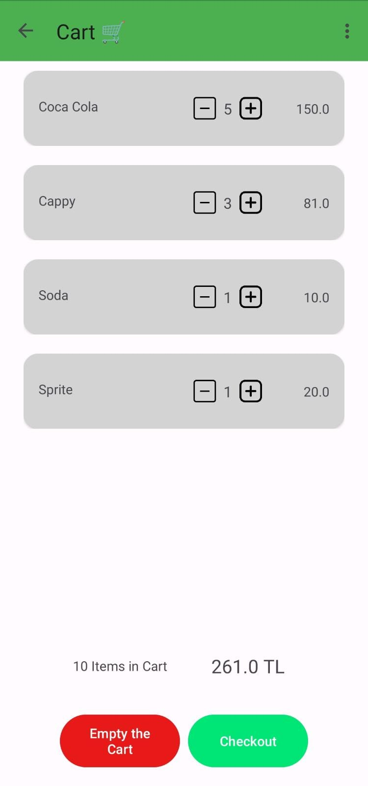
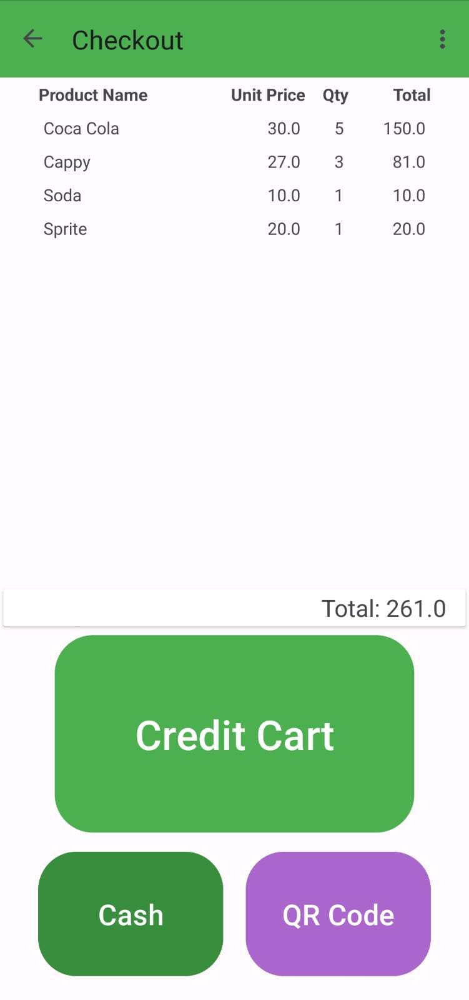

# Sales App - Phase 1

Welcome to Phase 1 of the Sales App project! This Android app, developed in Java, allows users to explore products, manage their cart, and complete purchases using various payment methods.

### Payment Methods
- **Barcode**
- **Cash**
- **Credit Card**

## Screenshots

  
  
  
  

## How to Use

1. **Login**: Upon launching the app, users are prompted to log in using their credentials.

2. **Product Listing**: After logging in, users are presented with a list of available products. They can click on a product to view its details.

3. **Cart**: Users can add products to the cart by clicking on the "Add to Cart" button. They can also adjust the quantity of items and remove products from the cart.

4. **Purchase**: To complete a purchase, users can navigate to the cart and click on the "Purchase" button. They will be directed to the payment screen.

5. **Payment**: On the payment screen, users can choose from three payment options: Barcode, Cash, or Credit Card. The total price of the items in the cart is displayed.

6. **Empty Cart**: Users can choose to empty the cart by clicking on the "Empty Cart" button.

## Technologies Used

### Programming Language

### Libraries and Frameworks
- **Android SDK**
- **Room Database**
- **RecyclerView**

### Architecture Pattern

- **MVVM**

### Version Control

### Dependency Management

### UI/UX Design
- **XML Layouts**
- **Material Design Guidelines**

### Integrated Development Environment (IDE)

### Version Control Hosting

### License

## Getting Started

1. Clone the repository:

2. Open the project in Android Studio.

3. Set up the necessary dependencies, including Room, RecyclerView, and any other required libraries.

4. Build and run the app on an emulator or a physical device.

## Contributing

Contributions are welcome! If you have any improvements or features to add, feel free to fork this repository and submit a pull request.

## License

This project is licensed under the [MIT License](LICENSE).

---
